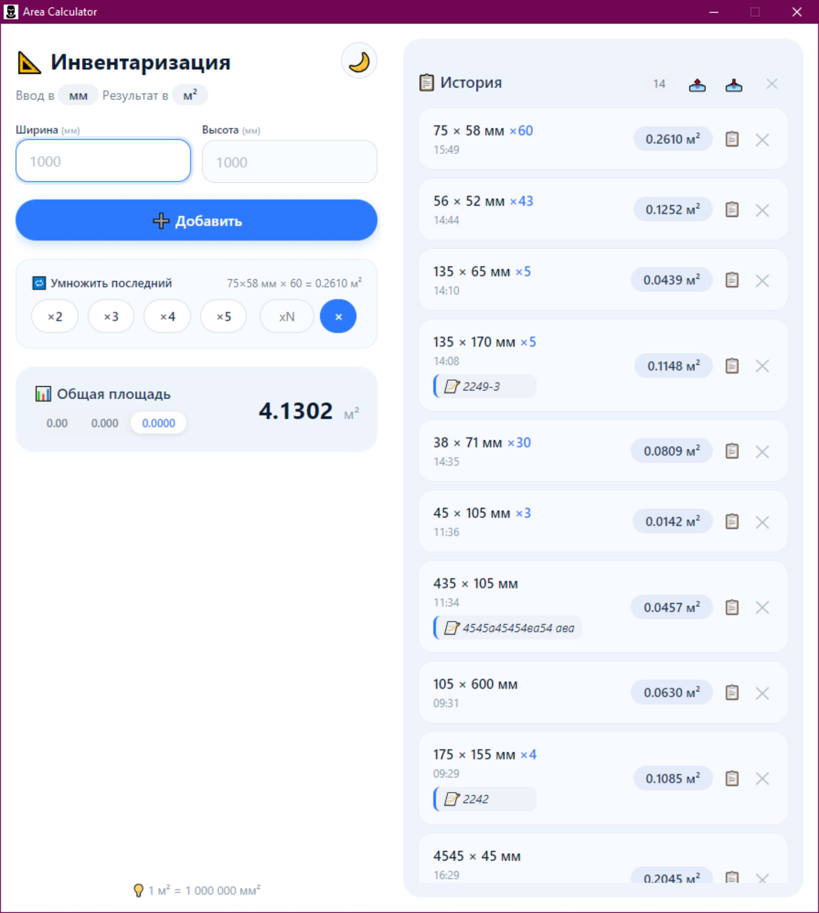
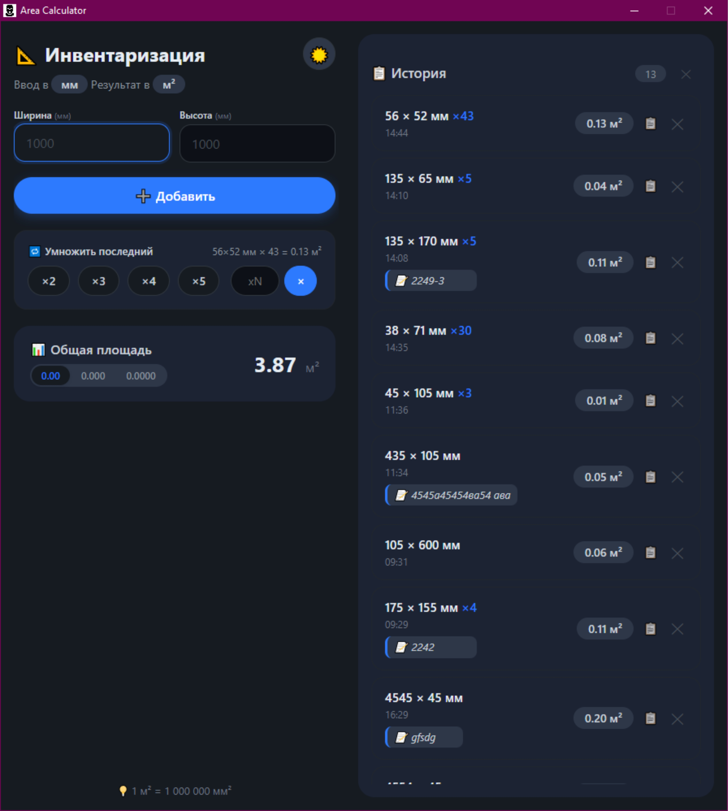

# 📐 Калькулятор площадей


> Простое приложение для расчёта площадей прямоугольников с поддержкой множителей, историей вычислений, которое я сделал для своих нужд с помощью нейросети DeepSeek.

---

## 📸 Скриншоты

| Светлая тема | Тёмная тема |
|--------------|-------------|
|  |  |

---

## ✨ Особенности

- 📏 **Ввод в миллиметрах** — площадь автоматически пересчитывается в квадратные метры
- 🔢 **Множитель** — умножьте последний результат на 2, 3, 4, 5, 10 или любое другое число
- 📋 **История вычислений** — все расчёты сохраняются и отображаются с датой/временем
- 📊 **Общая сумма** — автоматическое суммирование всех площадей
- 💾 **Сохранение данных** — история сохраняется в локальном хранилище
- 🚀 **Кроссплатформенность** — работает на Windows, macOS и Linux
- 🌓 **Тёмная тема** — переключайте тему одним кликом

---

## 📦 Установка и запуск

### 🔧 Требования

Перед началом убедитесь, что у вас установлены:

- [Node.js](https://nodejs.org/) (версия 16 или выше)
- [npm](https://www.npmjs.com/) (устанавливается вместе с Node.js)

Проверить установку можно командами:

```bash
node --version
npm --version
```

---

### 📥 Установка из исходников

#### 1️⃣ Клонируйте репозиторий

```bash
git clone https://github.com/your-username/area-calculator.git
cd area-calculator
```

#### 2️⃣ Установите зависимости

```bash
npm install
```

#### 3️⃣ Запустите приложение

```bash
npm start
```

---

### 🏗️ Сборка .exe (Windows)

#### Портативная версия (один файл)

```bash
npm run build:win:portable
```

Готовый файл: `dist/AreaCalculator_portable.exe`

#### Установщик (с инсталляцией)

```bash
npm run build:win
```

Готовый файл: `dist/Area Calculator Setup.exe`

---

### 🍏 Сборка для macOS

```bash
npm run build:mac
```

### 🐧 Сборка для Linux

```bash
npm run build:linux
```

---

## 📁 Структура проекта

```
area-calculator/
│
├── 📄 package.json          # Конфигурация и зависимости
├── 📄 main.js               # Главный процесс Electron
├── 📄 preload.js            # Мост между процессами
├── 📄 renderer.js           # Логика приложения
├── 📄 index.html            # Интерфейс
├── 📄 styles.css            # Стили (светлая/тёмная тема)
├── 🖼️ icon.ico              # Иконка приложения
├── 📄 README.md             # Документация
│
└── 📁 dist/                 # Папка со сборками (создаётся автоматически)
    ├── AreaCalculator_portable.exe
    ├── Area Calculator Setup.exe
    └── ...
```

### 📋 Описание файлов

| Файл | Назначение |
|------|------------|
| `package.json` | Зависимости проекта, скрипты сборки |
| `main.js` | Главный процесс, управление окнами, IPC |
| `preload.js` | Мост между main и renderer процессами |
| `renderer.js` | Вся логика приложения: расчёты, история, UI |
| `index.html` | HTML-разметка интерфейса |
| `styles.css` | Все стили с поддержкой тёмной темы |
| `icon.ico` | Иконка приложения (256x256) |

---

## 🗄️ Хранение данных

Данные сохраняются в файл `areas_history.json` в папке пользовательских данных приложения:

| Платформа | Путь |
|-----------|------|
| **Windows** | `%APPDATA%\area-calculator-app\areas_history.json` |
| **macOS** | `~/Library/Application Support/area-calculator-app/areas_history.json` |
| **Linux** | `~/.config/area-calculator-app/areas_history.json` |

### 📊 Формат данных

```json
[
  {
    "id": 1698765432100,
    "width": 2000,
    "height": 1500,
    "area": 3.00,
    "timestamp": 1698765432100,
    "isMultiplied": true,
    "multiplier": 3,
    "originalArea": 1.00
  }
]
```

### 📖 Поля данных

| Поле | Тип | Описание |
|------|-----|----------|
| `id` | number | Уникальный идентификатор |
| `width` | number | Ширина в мм |
| `height` | number | Высота в мм |
| `area` | number | Площадь в м² |
| `timestamp` | number | Время добавления (Unix timestamp) |
| `isMultiplied` | boolean | Создано ли через множитель |
| `multiplier` | number | Значение множителя |
| `originalArea` | number | Исходная площадь (до умножения) |

---

## 🎮 Как использовать

### Основные действия

1. **Введите ширину и высоту** в миллиметрах
2. Нажмите **"Добавить"** или клавишу **Enter**
3. Площадь появится в истории, общая сумма обновится

### 🔢 Множитель

- Нажмите **×2**, **×3**, **×4**, **×5** или **×10** — последний результат умножится
- Введите своё число в поле и нажмите **×** — результат умножится на указанное число

> 💡 **Важно:** Множитель заменяет последний результат, а не создаёт новый

### 🗂️ Управление историей

- **Удалить запись** — нажмите ✕ рядом с записью
- **Очистить историю** — нажмите ✕ в заголовке истории

<!-- ### 🌓 Смена темы

- Нажмите кнопку **🌙** или **☀️** в правом верхнем углу

--- -->

## 🛠️ Технологии

| Технология | Назначение |
|------------|------------|
| [Electron](https://www.electronjs.org/) | Фреймворк для настольных приложений |
| [Node.js](https://nodejs.org/) | Среда выполнения JavaScript |
| [CSS Variables](https://developer.mozilla.org/ru/docs/Web/CSS/Using_CSS_custom_properties) | Поддержка тёмной темы |
| [localStorage](https://developer.mozilla.org/ru/docs/Web/API/Window/localStorage) | Хранение данных |

---

## 🔧 Возможные проблемы и решения

### ❌ Ошибка при сборке

**Проблема:** Ошибка при выполнении `npm run build:win`

**Решение:**

```bash
# Очистите кэш и переустановите зависимости
rm -rf node_modules package-lock.json
npm install
npm run build:win
```

### 🚫 Приложение не запускается

**Проблема:** После `npm start` ничего не происходит

**Решение:**

- Убедитесь, что все файлы на месте
- Проверьте консоль на наличие ошибок
- Установите зависимости заново

### 💾 Не сохраняются данные

**Проблема:** После перезапуска история пуста

**Решение:**

- Проверьте права на запись в папку `%APPDATA%`
- Убедитесь, что файл `areas_history.json` создаётся

---

## 📝 Лицензия

Этот проект распространяется под лицензией MIT. Подробнее см. в файле [LICENSE](LICENSE).

---

## 🗓️ История версий

### v1.0.0 (2024)

- Первый релиз
- Базовый функционал: расчёт площади
- Множитель (×2, ×3, ×4, ×5, ×10)
- История вычислений
- Сохранение данных в localStorage
